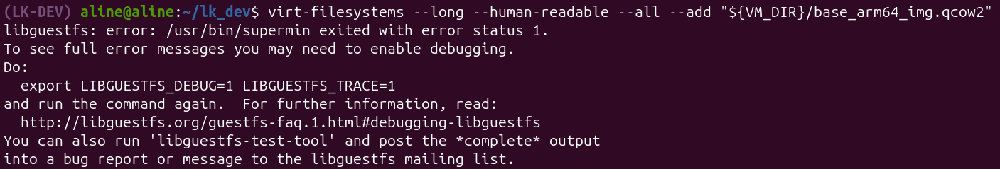
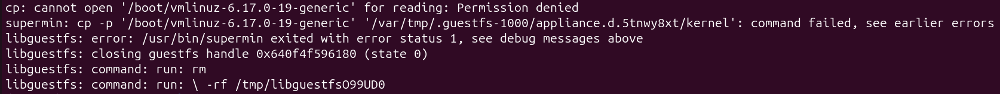
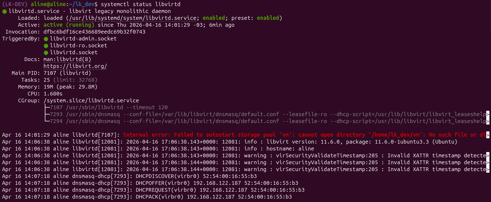
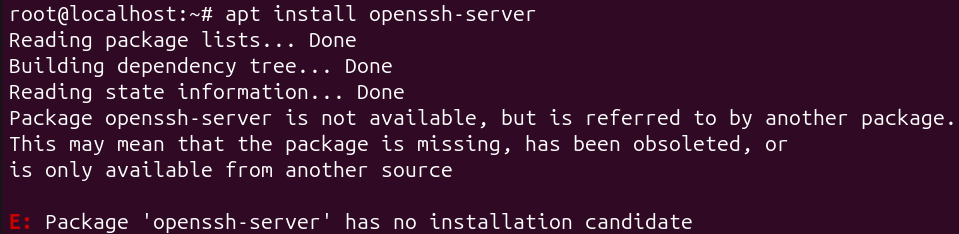

O primeiro tutorial foi sobre [**Setting up a test environment for Linux Kernel Dev using QEMU and libvirt**](https://flusp.ime.usp.br/kernel/qemu-libvirt-setup/). A seguir, os erros encontrados durante o processo.

## 2.1) Get a pre-existent OS disk image for the virtual machine

### Erro no link de download da imagem do disco

O link oferecido pelo tutorial para baixar a imagem do disco nocloud não funcionou. Portanto acessei o site com as imagens de disco do Debian (`http://cdimage.debian.org/cdimage/cloud/bookworm/daily/`) e busquei na pasta da versão mais recente o arquivo da imagem nocloud arm64 do debian com extensão qcow2. O comando ficou assim:

```bash
wget --directory-prefix="${VM_DIR}" http://cdimage.debian.org/cdimage/cloud/bookworm/daily/latest/debian-12-nocloud-arm64-daily.qcow2
```

## 2.2) Resize disk image rootfs

### Erro de Permissão do libguestfs

Quando fui rodar o comando para visualizar as informações do arquivo base da imagem do disco, a que foi baixado na etapa 1 deste tutorial, o sistema retornou o seguinte erro:


```bash
$virt-filesystems --long --human-readable --all --add "${VM_DIR}/base_arm64_img.qcow2"
libguestfs: error: /usr/bin/supermin exited with error status 1.
To see full error messages you may need to enable debugging.
Do:
  export LIBGUESTFS_DEBUG=1 LIBGUESTFS_TRACE=1
and run the command again.  For further information, read:
  http://libguestfs.org/guestfs-faq.1.html#debugging-libguestfs
You can also run 'libguestfs-test-tool' and post the *complete* output
into a bug report or message to the libguestfs mailing list.
```

Para tentar descobrir a causa do erro, executei o comando `libguestfs-test-tool 2>&1 | tail -50` que realiza um teste funcional completo do sistema. Dependendo do retorno do teste poderemos identificar qual é o problema. O retorno mostrou uma lista de libguestfs e supermin, e a seguinte linhas:


```bash
cp: cannot open '/boot/vmlinuz-6.17.0-19-generic' for reading: Permission denied
supermin: cp -p '/boot/vmlinuz-6.17.0-19-generic' '/var/tmp/.guestfs-1000/appliance.d.5tnwy8xt/kernel': command failed, see earlier errors
libguestfs: error: /usr/bin/supermin exited with error status 1, see debug messages above
libguestfs: closing guestfs handle 0x640f4f596180 (state 0)
libguestfs: command: run: rm
libguestfs: command: run: \ -rf /tmp/libguestfsO99UD0
```

O erro ocorre porque o libguestfs exige acesso de leitura ao arquivo do kernel em `/boot/vmlinuz-*` para construir seu appliance temporário. Nas versões recentes do Ubuntu (24.04+), as permissões desse arquivo são restritas ao superusuário por endurecimento (hardening) de segurança, o que impede a execução da ferramenta por usuários comuns. 
O que ajudou foi rodar o comando a seguir. É uma solução temporária, mas foi o suficiente para mim.

```bash
sudo chmod 644 /boot/vmlinuz-$(uname -r)
```

## 2.4) Use libvirt to streamline managing VMs

### Erro de Boot em VMs: O sistema cai no Initramfs ao confundir discos VirtIO e SATA?

Com a máquina virtual criada, sai e tentei entrar novamente com `sudo virsh console arm64`, mas, ao invés de aparecer `root@localhost:~#`, apareceu `(initramfs)`. O problema foi causado por um conflito na identificação do disco: o sistema estava configurado para buscar a partição raiz em `/dev/vda2`, mas como o disco foi apresentado à VM como um dispositivo SATA, o Linux o renomeou para `/dev/sda`. Como o caminho `/dev/vda2` não existia para o kernel, a inicialização falhou. 

Por isso, o sistema caiu no `(initramfs)`, que é um shell de recuperação carregado na memória RAM. Ele surge quando o kernel não consegue montar o sistema de arquivos raiz e interrompe o processo de boot, oferecendo um ambiente minimalista para diagnóstico.

Como solução foi necessário declarar `bus=virtio` na criação da VM, fazendo com que o disco fosse apresentado como um dispositivo Virtio com caminho `/dev/vda`. Assim, o kernel conseguiu encontrar o dispositivo esperado e montar corretamente a partição raiz. Portanto a função de criação da VM ficou da seguinte forma:

```bash
function create_vm_virsh() {
	sudo virt-install \
		--name "arm64" \
		--memory 2048 \
		--arch aarch64 --machine virt \
		--osinfo detect=on,require=off \
		--import \
		--features acpi=off \
		--disk path="${VM_DIR}/arm64_img.qcow2",bus=virtio # <--AQUI
		--boot kernel=${IIO_TREE}/arch/arm64/boot/Image,initrd=${BOOT_DIR}/initrd.img-6.1.0-43-arm64,kernel_args="loglevel=8 root=/dev/vda2 rootwait" \
		--network bridge:virbr0 \
		--graphics none
}
```

### Conflitos de Caminhos e Renomeação no Libvirt

Ao executar o comando `systemctl status libvirtd` apareceu o seguinte alerta:


```bash
Apr 16 14:01:29 aline libvirtd[7107]: internal error: Failed to autostart storage pool 'vm': cannot open directory '/home/lk_dev/vm': No such file or directory
```

A solução foi primeiro arrumar o caminho para a pasta vm com *pool-edit*. No entanto quando o comando de verificar status foi executado novamente o erro se tornou de conflito, em que dois storage pools (vm e vm-1) teriam o mesmo caminho. Então foi preciso deletar um dos pools, de preferencia o com caminho errado com *destroy* e depois *undefine*, e (opcional) alterar o nome da pool. A seguir os comando utilizados para a resolução do problema:

```bash
sudo systemctl stop libvirtd
virsh pool-edit vm		# editar para o caminho correto

# Lista os pools existentes
virsh pool-list --all

# Lista os pools existentes e os caminhos neles definidos
for pool in $(virsh pool-list --all --name); do 
    echo -n "Pool: $pool -> Path: "
    virsh pool-dumpxml $pool | grep -Po "(?<=<path>).*?(?=</path>)"

#Exporta as configurações do pool para um arquivo xml
virsh pool-dumpxml vm-1 > vm_pool.xml
virsh pool-destroy vm-1	# desativa a pool
virsh pool-undefine vm-1	# remove a pool

# Editar o nome do pool da vm no arquivo xml
nano vm_pool.xml

# Cria o pool de acordo com o arquivo xml
virsh pool-define vm_pool.xml
virsh pool-start vm
# Ativa função de auto inicialização
virsh pool-autostart vm
# Reinicia o libvirt
systemctl restart libvirtd
```

## 3) Configure SSH access from the host to the VM

### Arquivo sshd_config Não Encontrado

No começo da etapa é instruido editar o arquivo /etc/ssh/sshd_config dentro da máquina virtual, no entanto ao executar o comando `vim /etc/ssh/sshd_config` um arquivo em branco é aberto, e no final da tela o seguinte aviso aparece:

```bash
~
~
"/etc/ssh/sshd_config"
"/etc/ssh/sshd_config" E212: Can't open file for writing
Press ENTER or type command to continue
```

Assim como o aviso informa, o sistema não conseguiu encontrar o arquivo e teve que criar um em branco. O motivo de não ter encontrado é porque a máquina virtual não tinha instalado o SSH então tive que rodar o `apt install openssh-server` dentro da VM. Depois disso consegui abrir normalmente o arquivo e alterar o que foi intruido no tutorial.

### Erro ao instalar SSH na VM

Ao tentar instalar o OpenSSH, o sistema retornou que o pacote não possuía um candidato para instalação. A seguir a mensagem retornado pelo sistema:


```bash
apt install openssh-server
Reading package lists... Done
Building dependency tree... Done
Reading state information... Done
Package openssh-server is not available, but is referred to by another package.
This may mean that the package is missing, has been obsoleted, or
is only available from another source

E: Package 'openssh-server' has no installation candidate
```

Nessa situação, as causas prováveis eram duas: ou a VM carecia de conexão com a internet, ou o `apt` não possuía os endereços dos repositórios oficiais para localizar o `openssh-server`. A primeira hipótese foi descartada após o comando `ping -c 3 8.8.8.8` retornar positivamente, confirmando a conectividade externa. Restou, portanto, a segunda opção: a imagem base não continha os repositórios oficiais configurados. A solução foi definir manualmente as fontes do Debian Bookworm, criando o arquivo `/etc/apt/sources.list.d/debian.sources`, o que permitiu ao sistema localizar e baixar o pacote desejado. A seguir o comando utilizado para criar o arquivo source:

```bash
root@localhost:~# cat > /etc/apt/sources.list.d/debian.sources << EOF
Types: deb
URIs: http://deb.debian.org/debian
Suites: bookworm bookworm-updates
Components: main
Signed-By: /usr/share/keyrings/debian-archive-keyring.gpg

Types: deb
URIs: http://security.debian.org/debian-security
Suites: bookworm-security
Components: main
Signed-By: /usr/share/keyrings/debian-archive-keyring.gpg
EOF
```
