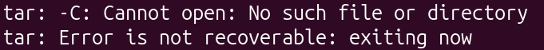

O segundo tutorial foi sobre [**Building and booting a custom Linux kernel for ARM using kw**](https://flusp.ime.usp.br/kernel/build-linux-for-arm-kw/). A seguir, os erros encontrados durante o processo.

## 4) Configuring the Linux kernel compilation

### Comando rsync Não Encontrado

Ao executar o comando `kw ssh --get '~/vm_mod_list'` o terminal devolveu o seguinte erro:

```bash
bash: line 1: rsync: command not found
rsync: connection unexpectedly closed (0 bytes received so far) [Receiver]
rsync error: error in rsync protocol data stream (code 12) at io.c(232) [Receiver=3.4.1]
An error occurred while uploading the file(s). rsync return code: 12
```

Assim como podemos ver na primeira linha do erro, o sistema não conseguiu localizar o rsync. Esta ferramenta é utilizada para copiar e sincronizar arquivos e diretórios, seja localmente ou entre máquinas remotas via rede (geralmente através do protocolo SSH). Por ser um sincronizador bidirecional, o rsync exige que ambos os lados da conexão possuam a ferramenta instalada para coordenar a transferência diferencial de dados. Neste caso, como a VM não possuía o pacote, a conexão foi encerrada abruptamente. Portanto, a solução era simplesmente a instalação do rsync no ambiente de destino, ou seja, a VM.

```bash
rsync --version # verificar se já não está instalado
sudo apt update && sudo apt install rsync -y
```

## Complementary Commands

O camando utilizado para descompactar o arquivo `gcc-aarch64-linux-gnu.tar.xz` na pasta `lk_dev` não funcionou na minha máquina, devolvedo o seguinte erro:



A solução foi simplesmenete trocar a ordem dentro do comando. O problema estava na posição da flag `-f`. O comando `tar` é sensível à ordem: a flag `-f` deve ser seguida imediatamente pelo nome do arquivo de origem. O que não foi o caso do comando original.

```bash
# Comando original
tar -xf -C "$LK_DEV_DIR" "${LK_DEV_DIR}/gcc-aarch64-linux-gnu.tar.xz"

# Comando modificado
tar -xf "${LK_DEV_DIR}/gcc-aarch64-linux-gnu.tar.xz" -C "$LK_DEV_DIR"
```