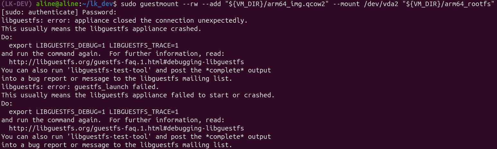

O terceiro tutorial foi sobre [**Introduction to Linux kernel build configuration and modules**](https://flusp.ime.usp.br/kernel/modules-intro/). A seguir, os erros encontrados durante o processo.

## 3) Configuring the Linux kernel build with menuconfig

### Conexão Interrompida Inesperadamente

Ao executar o comando que abre o disco rígido da VM dentro de uma pasta do host, o sistema retornou um erro.
```bash
sudo guestmount --rw --add "${VM_DIR}/arm64_img.qcow2" --mount /dev/<rootfs> "${VM_DIR}/arm64_rootfs"
```



```
libguestfs: error: appliance closed the connection unexpectedly.
This usually means the libguestfs appliance crashed.
Do:
  export LIBGUESTFS_DEBUG=1 LIBGUESTFS_TRACE=1
and run the command again.  For further information, read:
  http://libguestfs.org/guestfs-faq.1.html#debugging-libguestfs
You can also run 'libguestfs-test-tool' and post the *complete* output
into a bug report or message to the libguestfs mailing list.
libguestfs: error: guestfs_launch failed.
This usually means the libguestfs appliance failed to start or crashed.
Do:
  export LIBGUESTFS_DEBUG=1 LIBGUESTFS_TRACE=1
and run the command again.  For further information, read:
  http://libguestfs.org/guestfs-faq.1.html#debugging-libguestfs
You can also run 'libguestfs-test-tool' and post the *complete* output
into a bug report or message to the libguestfs mailing list.
```

O erro ocorria pois a VM estava rodando. Quando um comando `guestmount` é executado enquanto a máquina está rodando há uma grande chance de isso corromper o sistema de arquivos da VM, pois dois núcleos estaria tentando escrever no mesmo disco ao mesmo tempo. Então a solução foi simplesmente para a VM.

```bash
virsh stop arm64
# Ou
virsh shutdown arm64 
```

## 4) Installing Linux kernel modules

### Módulo simple_mod Não Encontrado

Ao tentar executar o comando para mostrar as informações do módulo `simple_mod` o sistema retornou o seguinte erro:

```bash
root@localhost:~# modinfo simple_mod
modinfo: ERROR: Module simple_mod not found.
```

O comando modinfo tem como função extrair metadados de arquivos binários de módulos do kernel (extensão `.ko`), como autor, licença e descrição. No entanto, ao tentar executá-lo para o `simple_mod`, o sistema retornou um erro de 'módulo não encontrado'. A falha ocorreu porque o arquivo `simple_mod.ko` ainda não havia sido transferido da máquina hospedeira para a VM. Sem o arquivo presente localmente no sistema de arquivos da VM, o `modinfo` não possui um alvo para leitura, impossibilitando a exibição das informações do módulo.
