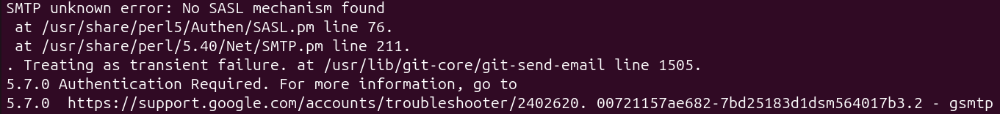

O erros encontrados estão relacionados ao seguinte tutorial:
https://flusp.ime.usp.br/git/sending-patches-with-git-and-a-usp-email/

### Testing the setup with kw send-patch

Quando enviei o patch sem a opção `--simulated` o sistema retornava o seguinte erro:

E a solução foi executar o commando `sudo cpan Authen::SASL::Perl::XOAUTH2`. O comando acessa o repositório central de módulo Perl e baixa o código que formata os dados no padrão XOAUTH2.

O kw prepara o patch e organiza as informações do e-mail (como destinatário e formato) de acordo com as configurações do arquivo de config e os argumentos passados pelo usuário. Em seguida, ele invoca o comando git send-email, entregando para ele o patch e as instruções de envio. É nesse momento que o problema ocorria: o send-email tentava iniciar a conexão, mas não encontrava o driver necessário para se autenticar no Gmail.

Digamos que o send-email pede permissão para o Gmail para enviar algo. Mas antes disso o Gmail pede o envelope de autenticação específico para saber se o remetente é seguro. Com isso o send-email pede para o Authen::SASL o envelope de autenticação, como este é apenas um gerenciador ele busca o responsável específico por montar o envelope de autenticação que o Gmail quer. Esse responsável é o driver XOAUTH2, que vai pegar o seu email e a sua chave gerada pelo git-credential-gmail (armazenada no `git credential-gmail`) e vai montar o envelope de autenticação. Por fim o envelope vai seguir o caminho contrário até chegar no Gmail.

Então se o driver que conhece o protocolo exigido pelo Gmail não estiver instalado o Authen::SASL não vai conseguir encontrar o driver e vai avisar os processos anteriores gerando o erro acima.