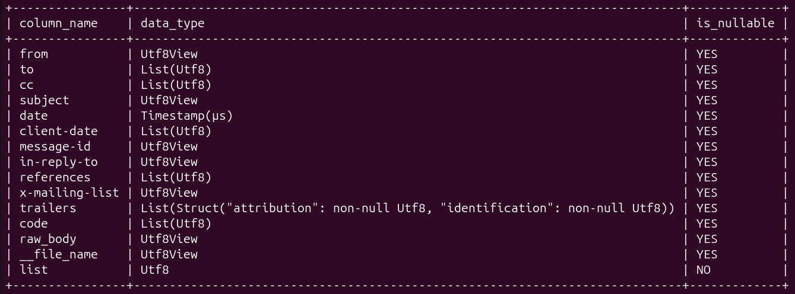
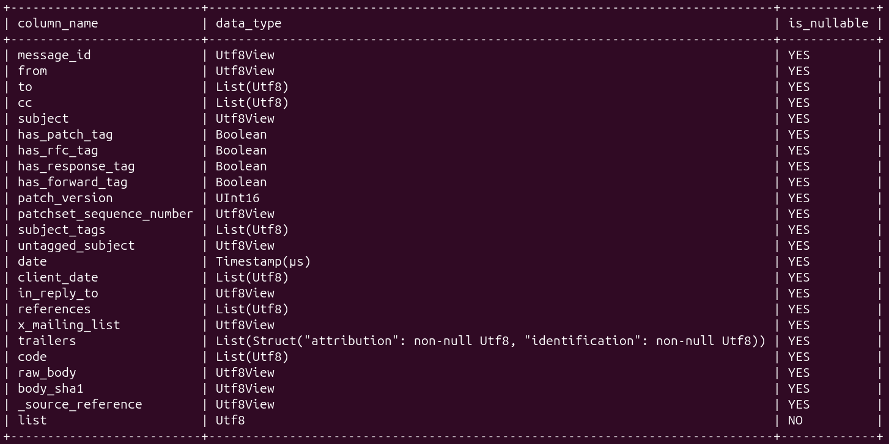

A contribuição escolhida foi a atualização do dataset do projeto [OnboardingFlow - Journal](https://lauraarakakii.github.io/posts/manuscript/#data-export-and-visualization-layer) e a adição de novas tabelas no [OnboardingFlow Dashboard — Interactive Visualization of the netdev Contributor Funnel](https://lauraarakakii.github.io/posts/manuscript-results/) ambos desenvolvidos pela [Laura Arakaki](https://lauraarakakii.github.io/).

O conjunto de dados tinha as seguintes informações:

Enquanto o atual conjunto de dados possuem as seguintes informações:

A minha função foi que de acordo com os novos arquivos ajustados pela Laura eu fizesse um novo conjunto de tabelas do dashboard utilizando as novas informações adquiridas.

### Resultados
